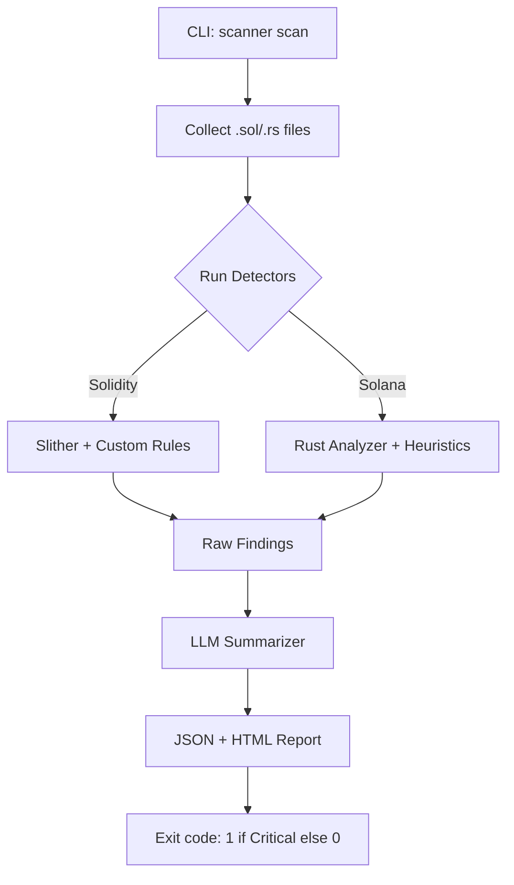

# Web3 Security Scout

> AI‑augmented static analysis for Ethereum/Solana smart contracts — find vulnerabilities fast, generate exploits, get remediation steps.

[](https://python.org)
[](LICENSE)
[](.github/workflows/ci.yml)

## Problem

Smart contract security audits are expensive and slow. You need to catch common vulnerabilities (reentrancy, overflow, front‑running) before mainnet, but running Slither/Solhint manually is time‑consuming, and interpreting results requires expertise.

## Solution

`web3-security-scout` is a CLI tool that:

- Runs static analysis (Slither for Solidity, simple heuristics for Solana)
- Uses an LLM (via `ollama` or OpenAI) to explain findings in plain language
- Generates proof‑of‑concept exploit snippets
- Suggests specific remediation steps per issue type
- Outputs JSON and HTML reports

Result: Quick, repeatable security checks integrated into your CI pipeline.

## Features

- Support for Solidity (EVM) and Rust (Solana) contracts
- Automatic detection of: reentrancy, integer overflow/underflow, unchecked low‑level calls, front‑running, access control issues
- AI‑summarized findings with severity (Critical/High/Medium/Low)
- JSON and HTML report generation
- GitHub Actions integration (fails build on Critical)
- Extensible — add new detectors easily

## Quickstart

```bash
# Install
pip install web3-security-scout

# Scan a Solidity project
scanner scan contracts/ --blockchain ethereum --output report.html

# Or using Docker
docker run -v $(pwd)/contracts:/code gboyee/web3-security-scout scan /code --blockchain solana
```

## Demo


## Architecture



## Configuration

Create a `scanner.yaml`:

```yaml
llm:
  provider: ollama  # or openai
  model: llama3
  api_key: ${OPENAI_API_KEY}  # if using OpenAI
detectors:
  - reentrancy
  - overflow
  - access_control
  - frontrunning
report:
  format: [json, html]
  output: security-report.html
```

## CI Example

```yaml
name: Security Scan
on: [push, pull_request]
jobs:
  scan:
    runs-on: ubuntu-latest
    steps:
      - uses: actions/checkout@v4
      - name: Install scanner
        run: pip install web3-security-scout
      - name: Run scan
        run: scanner scan contracts/ --blockchain ethereum --output report.json
      - name: Upload report
        uses: actions/upload-artifact@v4
        with:
          name: security-report
          path: report.json
```

## Developing

```bash
git clone https://github.com/GBOYEE/web3-security-scout.git
cd web3-security-scout
pip install -r requirements.txt
pytest -q
```

## Roadmap

- [ ] ZK‑sync and optimized detectors for DeFi patterns
- [ ] Integration with HiveSec‑Ecosystem‑Hub dashboard
- [ ] Historical CVE correlation
- [ ] Automatic PR remediation suggestions

## License

MIT. See [LICENSE](LICENSE).
